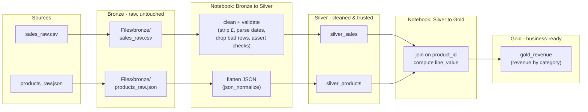

# HomeSphere Pipeline - Solution Diagram

*The completed medallion architecture after Day 3.*



| Layer  | Items | Rule |
|--------|-------|------|
| Bronze | `Files/bronze/sales_raw.csv`, `Files/bronze/products_raw.json` | Never modified after landing |
| Silver | `silver_sales`, `silver_products` | Cleaned, validated - safe to build from |
| Gold   | `gold_revenue` | Built from silver only - answers the business question |

---

### Mermaid Diagram Code

```text
flowchart LR
    subgraph SRC["Sources"]
        CSV["sales_raw.csv"]
        JSON["products_raw.json"]
    end

    subgraph BRZ["Bronze - raw, untouched"]
        BCSV["Files/bronze/\nsales_raw.csv"]
        BJSON["Files/bronze/\nproducts_raw.json"]
    end

    subgraph NB1["Notebook: Bronze to Silver"]
        CLEAN["clean + validate\n(strip £, parse dates,\ndrop bad rows, assert checks)"]
        FLAT["flatten JSON\n(json_normalize)"]
    end

    subgraph SIL["Silver - cleaned & trusted"]
        SS["silver_sales"]
        SP["silver_products"]
    end

    subgraph NB2["Notebook: Silver to Gold"]
        JOIN["join on product_id\ncompute line_value"]
    end

    subgraph GLD["Gold - business-ready"]
        GR["gold_revenue\n(revenue by category)"]
    end

    CSV --> BCSV
    JSON --> BJSON
    BCSV --> CLEAN
    BJSON --> FLAT
    CLEAN --> SS
    FLAT --> SP
    SS --> JOIN
    SP --> JOIN
    JOIN --> GR
```

